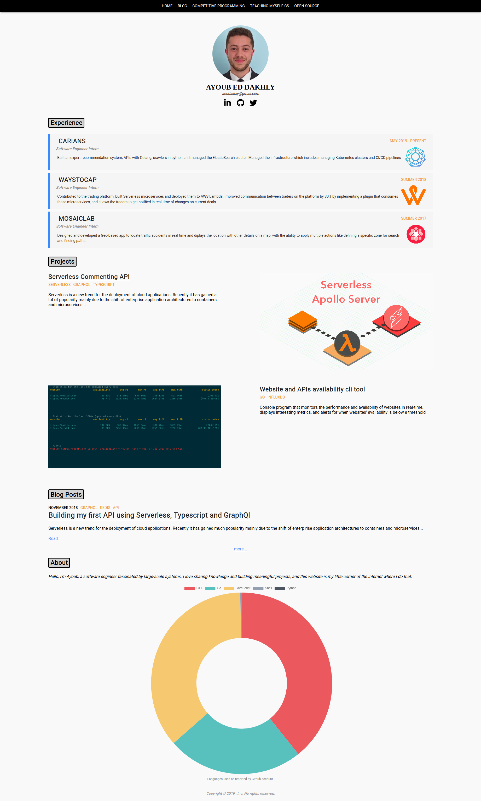
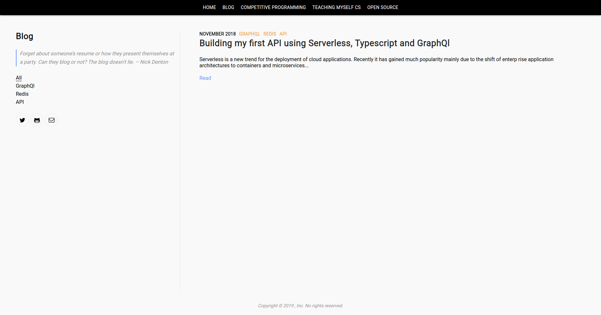
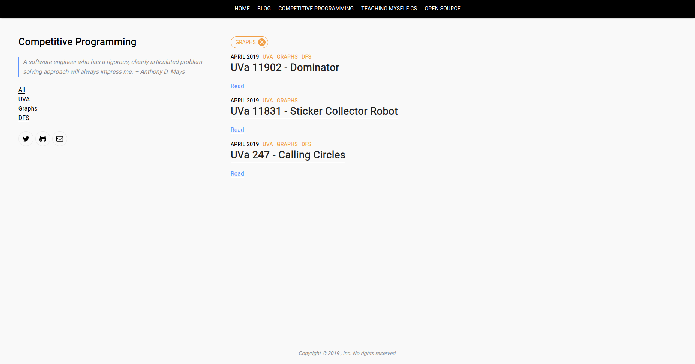
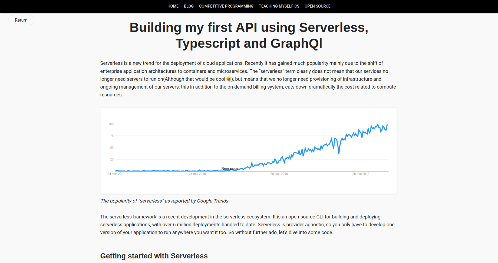

# About the project
This blogging platform enables you to create posts using Markdown, and define all your posts using JSON. 

You can define all you blog posts in `src/content/lists.js`. You can add a title, tags and a description for the preview of the blog post.

```
//Post Lists
export const blog = [
  {
    date: "2018-11-27",
    tag: ["graphql", "redis", "API"],
    title: "Building my first API using Serverless, Typescript and GraphQl",
    link: "building-my-first-api-using-serverless-typescript-and-graphql",
    description:
      "Serverless is a new trend for the deployment of cloud applications. Recently it has gained much popularity mainly due to the shift of enterp    rise application architectures to containers and microservices..."
  }
];
```

### The end result looks like this.

<p align="center">
  
</p>

### The blog page

<p align="center">
  
</p>

### You can filter by tags

<p align="center">
  
</p>

#  The blog posts are defined using Mardown, they use a similar style to Githubs Readme page. You can add code blocks, images, links...

<p align="center">
  
</p>


# Make your own blog

This project was bootstrapped with [Create React App](https://github.com/facebook/create-react-app).

## Available Scripts

In the project directory, you can run:

### `npm start`

Runs the app in the development mode.<br>
Open [http://localhost:3000](http://localhost:3000) to view it in the browser.

The page will reload if you make edits.<br>
You will also see any lint errors in the console.

### `npm test`

Launches the test runner in the interactive watch mode.<br>
See the section about [running tests](https://facebook.github.io/create-react-app/docs/running-tests) for more information.

### `npm run build`

Builds the app for production to the `build` folder.<br>
It correctly bundles React in production mode and optimizes the build for the best performance.

The build is minified and the filenames include the hashes.<br>
Your app is ready to be deployed!

See the section about [deployment](https://facebook.github.io/create-react-app/docs/deployment) for more information.